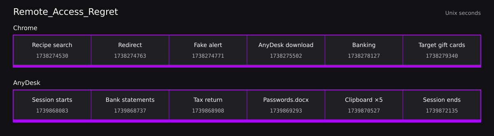

# Remote_Access_Regret — Hack The Box Sherlock


by: Brandon Chaney

## Overview

Margaret fell for a phishing scam from a browser popup. Ultimately, she gave an unknown caller from the scam remote access to her computer and forwarded a lump sum in gift cards as payment, yikes 😓. I’m left with one file, `intelvol.raw`, on the system.

## Finding the mounted image

Listing the block devices, it looks like we’re mounted at **/media/root/INTELVOL**.

```bash
analyst@Remote-Access-Regret:~/Desktop/ChallengeFile$ lsblk

NAME     MAJ:MIN RM  SIZE RO TYPE MOUNTPOINT
loop0      7:0    0 27.8M  1 loop /snap/amazon-ssm-agent/12322
loop1      7:1    0 25.2M  1 loop /snap/amazon-ssm-agent/7993
loop2      7:2    0 55.4M  1 loop /snap/core18/2846
loop3      7:3    0 55.5M  1 loop /snap/core18/2979
loop4      7:4    0   64M  1 loop /snap/core20/2379
loop5      7:5    0 38.8M  1 loop /snap/snapd/21759
loop6      7:6    0 91.9M  1 loop /snap/lxd/29619
loop7      7:7    0   74M  1 loop /snap/core22/2339
loop8      7:8    0 63.7M  1 loop /snap/core20/2434
loop9      7:9    0 91.9M  1 loop /snap/lxd/36554
loop10     7:10   0 44.4M  1 loop /snap/snapd/23545
**loop11** 7:11   0  128M  1 loop /media/root/INTELVOL
sda        8:0    0   30G  0 disk
└─sda1     8:1    0   30G  0 part /
sr0       11:0    1 1024M  0 rom
```

## Margaret’s AnyDesk ID

Looking at Margaret’s AnyDesk configuration, we can see its ID.

```bash
analyst@Remote-Access-Regret:~/Desktop/ChallengeFile$ sudo cat /media/root/INTELVOL/Users/Margaret/AppData/Roaming/AnyDesk/system.conf

[license]
key=

[client]
**id=847291503**

[user_interface]
; gui_language is unset, defaults to system language

[connection]
direct_auto_accept=0

[recording]
session_recording=0

[security]
unlock_password_hash=
access_control_list=
```

## Chrome history

Next, I copy out her local history—10 websites—and query the SQLite database through Python3. We can see the website leading to the scam.

```python
('https://www.target.com/c/gift-cards/-/N-5xsxu', 'Gift Cards : Target', 13382752940000000)
('https://www.target.com/', 'Target : Expect More. Pay Less.', 13382752875000000)
('https://secure.bankofamerica.com/myaccounts/signin/signIn.go', 'Sign In - Bank of America', 13382751802000000)
('https://www.bankofamerica.com/', 'Bank of America - Banking, Credit Cards, Loans', 13382751727000000)
('https://anydesk.com/en/downloads/windows', 'Download AnyDesk for Windows', 13382749102000000)
('https://support-windows-defender.com/alert/critical.php', 'Microsoft Windows Defender Alert', 13382748371000000)
('http://ww1.windows-security-alert.com/warning/?tid=8847291', '', 13382748363000000)
('https://www.allrecipes.com/recipe/221958/perfect-roast-turkey/', 'Perfect Roast Turkey Recipe | Allrecipes', 13382748305000000)
('https://www.allrecipes.com/recipes/17562/holidays-and-events/thanksgiving/', 'Thanksgiving Recipes | Allrecipes', 13382748225000000)
('https://www.google.com/search?q=thanksgiving+recipes', 'thanksgiving recipes - Google Search', 13382748130000000)
```

We can also see a little bit of the attack chain: Margaret was looking for Thanksgiving recipes, then the scam alert appears, AnyDesk is downloaded, and we see banking and Target gift cards following. This matches the sequence we were given at the start.

The initial malicious domain to keep track of is `ww1(.)windows-security-alert(.)com`.

## Finding the phone number

The phone number can also be found through strings analysis:

```bash
analyst@Remote-Access-Regret:~/Desktop/ChallengeFile$ sudo grep -aERo '\+?1?[-. ()]*[0-9]{3}[-. ()]*[0-9]{3}[-. ]*[0-9]{4}' \
>

intelvol.raw:849625-5478
intelvol.raw:8020000000
intelvol.raw:1-3842939050
intelvol.raw:-1298923927
intelvol.raw:-2084739842
intelvol.raw:849625-5478
intelvol.raw:8020000000
intelvol.raw:1-3842939050
intelvol.raw:-1298923927
intelvol.raw:-2084739842
intelvol.raw:849625-5478
intelvol.raw:8020000000
intelvol.raw:1-3842939050
intelvol.raw:-1298923927
intelvol.raw:-2084739842
intelvol.raw:849625-5478
intelvol.raw:8020000000
intelvol.raw:1-3842939050
intelvol.raw:-1298923927
intelvol.raw:-2084739842
intelvol.raw:849625-5478
intelvol.raw:8020000000
intelvol.raw:1-3842939050
intelvol.raw:-1298923927
intelvol.raw:-2084739842
intelvol.raw:849625-5478
intelvol.raw:8020000000
intelvol.raw:1-3842939050
intelvol.raw:-1298923927
intelvol.raw:-2084739842
**intelvol.raw:+1 (888) 351-4019**
```

## The remote session

The attacker’s remote ID and alias, as well as some file transfers, can be found in Margaret’s AnyDesk artifacts. The session lasted for an hour, 7 minutes, and 32 seconds.

```bash
analyst@Remote-Access-Regret:~/Desktop/ChallengeFile$ sudo strings /media/root/INTELVOL/Users/Margaret/AppData/Roaming/AnyDesk/ad.trace | less

info 2025/02/18 08:35:11.452 anydesk - AnyDesk starting
info 2025/02/18 08:35:11.891 anydesk - Version: 8.0.8
info 2025/02/18 08:35:12.003 anydesk - Platform: win32
info 2025/02/18 08:35:12.445 anydesk - License type: free
info 2025/02/18 08:35:12.892 anydesk - Assigned ID: 847291503
info 2025/02/18 08:35:13.112 anydesk - Relay server connected
info 2025/02/18 08:35:13.445 anydesk - Ready for connections
info 2025/02/18 08:41:17.332 anydesk - Incoming session request
**info 2025/02/18 08:41:17.334 anydesk - Remote ID: 529481627**
**info 2025/02/18 08:41:17.445 anydesk - Alias: MicrosoftSupport**
info 2025/02/18 08:41:23.108 anydesk - Session request accepted by local user
info 2025/02/18 08:41:23.445 anydesk - Session established
info 2025/02/18 08:41:23.446 anydesk - Session ID: ses_748291037
info 2025/02/18 08:41:23.891 anydesk - Permissions granted: input,clipboard,filetransfer
info 2025/02/18 08:41:28.223 anydesk - Clipboard sync enabled
info 2025/02/18 08:42:15.108 anydesk - Remote input: keyboard active
info 2025/02/18 08:48:22.445 anydesk - File manager opened by remote
info 2025/02/18 08:52:17.663 anydesk - File transfer: upload started
info 2025/02/18 08:52:17.891 anydesk - File transfer: C:\Users\Margaret\Desktop\Bank Statements 2024.pdf
info 2025/02/18 08:52:22.445 anydesk - File transfer: complete (247293 bytes)
info 2025/02/18 08:55:08.227 anydesk - File transfer: upload started
info 2025/02/18 08:55:08.334 anydesk - File transfer: C:\Users\Margaret\Documents\Tax Return 2023.pdf
info 2025/02/18 08:55:14.772 anydesk - File transfer: complete (1293847 bytes)
info 2025/02/18 09:01:33.112 anydesk - File transfer: upload started
info 2025/02/18 09:01:33.445 anydesk - File transfer: C:\Users\Margaret\Desktop\Passwords.docx
info 2025/02/18 09:01:35.221 anydesk - File transfer: complete (18293 bytes)
info 2025/02/18 09:22:07.881 anydesk - Clipboard: text copied to remote (19 chars)
info 2025/02/18 09:32:18.445 anydesk - Clipboard: text copied to remote (19 chars)
info 2025/02/18 09:34:55.221 anydesk - Clipboard: text copied to remote (19 chars)
info 2025/02/18 09:37:33.118 anydesk - Clipboard: text copied to remote (19 chars)
info 2025/02/18 09:40:08.445 anydesk - Clipboard: text copied to remote (19 chars)
info 2025/02/18 09:48:55.334 anydesk - Session closing
info 2025/02/18 09:48:55.445 anydesk - Remote disconnected
info 2025/02/18 09:48:55.667 anydesk - Session ended: ses_748291037
**info 2025/02/18 09:48:55.668 anydesk - Session duration: 4052 seconds**
info 2025/02/18 09:48:55.891 anydesk - Total transferred: 1559433 bytes uploaded
```

Three files were confirmed exfiltrated (**1,559,433 bytes**), along with some clipboard copying of 19-character strings, five times.

08:52:17 — `C:\Users\Margaret\Desktop\Bank Statements 2024.pdf`

- 247,293 bytes

08:55:08 — `C:\Users\Margaret\Documents\Tax Return 2023.pdf`

- 1,293,847 bytes

09:01:33 — `C:\Users\Margaret\Desktop\Passwords.docx`

- 18,293 bytes

Clipboard activity:

```text
09:22:07
09:32:18
09:34:55
09:37:33
09:40:08
```

## Timeline



## Key Findings

- Chrome history shows recipe browsing, the scam alert, the AnyDesk download, and visits to banking and gift-card pages.
- Margaret’s AnyDesk ID was `847291503`; the attacker connected with remote ID `529481627` and alias `MicrosoftSupport`.
- The remote session lasted **1 hour, 7 minutes, and 32 seconds**.
- Three files were exfiltrated, totaling **1,559,433 bytes**.
- Five clipboard entries recorded 19-character strings copied to the remote side.

## Resources

- [https://www.inversecos.com/2021/02/forensic-analysis-of-anydesk-logs.html](https://www.inversecos.com/2021/02/forensic-analysis-of-anydesk-logs.html)
- [https://support.anydesk.com/what-are-trace-files](https://support.anydesk.com/what-are-trace-files)
- [https://www.inversecos.com/2021/02/forensic-analysis-of-anydesk-logs.html](https://www.inversecos.com/2021/02/forensic-analysis-of-anydesk-logs.html)
